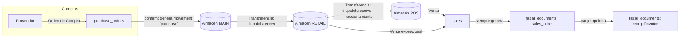
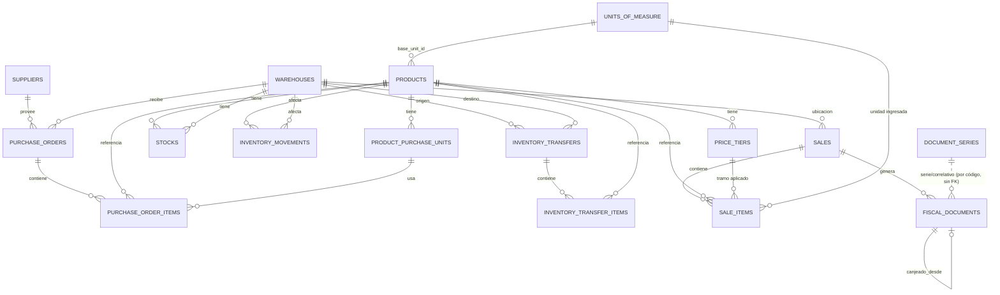

# Modelo de Datos: Inventario Multi-Almacén + POS

Documento de referencia del dominio de negocio (catálogo, precios por tramo, almacenes/transferencias, ventas y documentos fiscales) antes de implementarlo. Sirve como contrato entre negocio y código.

## 1. Flujo general

Reglas clave del flujo:
- El stock siempre se mueve en la **Unidad de Medida Base (UMB)** del producto (gramos, mililitros o unidades), nunca en la presentación de compra.
- El stock "en tránsito" entre almacenes no pertenece a ninguno mientras la transferencia está `in_transit` (se descuenta del origen al despachar, se suma al destino al recibir).
- Toda venta descuenta stock **una sola vez**. El canje de Ticket → Boleta/Factura no vuelve a tocar inventario.

## 2. Diagrama entidad-relación

## 3. Tablas

### 3.1 Catálogo

**`units_of_measure`** — unidades base para conversión (solo se convierte dentro del mismo `type`)
| columna | tipo | notas |
|---|---|---|
| id | bigint PK | |
| code | string unique | `g`, `ml`, `unit` |
| name | string | Gramos, Mililitros, Unidad |
| type | enum(weight, volume, count) | familia de conversión |

**`products`**
| columna | tipo | notas |
|---|---|---|
| id | bigint PK | |
| sku | string unique | |
| name | string | |
| description | text nullable | |
| base_unit_id | FK → units_of_measure (restrict) | UMB del producto |
| is_active | boolean default true | |
| deleted_at | soft delete | no romper histórico de movimientos |

**`product_purchase_units`** — presentaciones de compra (saco, caja, etc.)
| columna | tipo | notas |
|---|---|---|
| id | bigint PK | |
| product_id | FK → products (cascade) | |
| name | string | "saco 50kg" |
| conversion_factor | decimal(18,6) | 1 unidad de esta presentación = X UMB |
| barcode | string nullable | |
| is_default_purchase | boolean default false | |
| — | unique(product_id, name) | |

**`price_tiers`** — tramos de precio configurables por producto
| columna | tipo | notas |
|---|---|---|
| id | bigint PK | |
| product_id | FK → products (cascade) | |
| min_quantity | decimal(18,6) | en UMB, inclusive |
| max_quantity | decimal(18,6) nullable | en UMB, inclusive; null = sin tope |
| unit_price | decimal(12,4) | precio por unidad de UMB |
| label | string nullable | "Mayorista", "Menudeo" |
| is_active | boolean default true | |

No solapamiento de rangos por producto → validado en `ValidatePriceTierRangeAction`, no en constraint de BD.

### 3.2 Almacenes y stock

**`warehouses`** — 3 registros fijos sembrados por seeder
| columna | tipo | notas |
|---|---|---|
| id | bigint PK | |
| code | string unique | `MAIN`, `RETAIL`, `POS` |
| name | string | |
| type | enum(main, retail, pos) | rol fijo |
| is_active | boolean default true | |

**`stocks`** — saldo Kardex actual (nunca editado directo, solo vía `StockLedgerService` + lock)
| columna | tipo | notas |
|---|---|---|
| id | bigint PK | |
| warehouse_id | FK → warehouses (cascade) | |
| product_id | FK → products (cascade) | |
| quantity | decimal(18,6) default 0 | siempre en UMB |
| average_cost | decimal(12,4) default 0 | costo unitario promedio ponderado |
| total_cost | decimal(14,4) default 0 | `quantity * average_cost` (cacheado) |
| — | unique(warehouse_id, product_id) | |

**`inventory_movements`** — libro mayor Kardex, append-only (sin update/destroy expuestos)
| columna | tipo | notas |
|---|---|---|
| id | bigint PK | |
| product_id | FK → products (restrict) | |
| warehouse_id | FK → warehouses (restrict) | almacén afectado |
| type | enum(purchase, transfer_in, transfer_out, sale, adjustment) | entrada: purchase/transfer_in; salida: transfer_out/sale; adjustment usa `direction` |
| quantity | decimal(18,6) | siempre positivo, el signo lo da `type`/`direction` |
| direction | enum(increase, decrease) nullable | solo aplica a `adjustment` |
| unit_cost | decimal(12,4) nullable | costo de esta entrada, o costo promedio vigente si es salida |
| balance_quantity | decimal(18,6) | saldo de cantidad después de este movimiento |
| balance_unit_cost | decimal(12,4) | costo promedio ponderado después de este movimiento |
| balance_total_cost | decimal(14,4) | `balance_quantity * balance_unit_cost` |
| reference_type / reference_id | string / bigint nullable | referencia manual a PurchaseOrder/InventoryTransfer/Sale |
| notes | text nullable | |
| created_by | FK → users (nullable, set null) | |

Costeo: **promedio ponderado** (no PEPS/lotes, consistente con la decisión de no manejar lotes). Las entradas (`registerIn`) recalculan `average_cost` con el costo de la compra/transferencia. Las salidas (`registerOut`) siempre usan el `average_cost` vigente como costo de la salida y no lo modifican — solo reducen el saldo. Servicio: **`App\Services\StockLedgerService`** (`registerIn`, `registerOut`, `balance`), transaccional con `lockForUpdate()` sobre la fila de `stocks` para concurrencia segura, aritmética con `bcmath` para evitar errores de precisión.

### 3.3 Compras

**`suppliers`**: `name`, `document_number` (RUC), `phone`, `email`, `is_active`.

**`productables`** es la tabla polimórfica compartida de líneas de producto. La relación se identifica con `productable_type` + `productable_id` y puede apuntar a `PurchaseOrder`, `InventoryTransfer` o `Sale`.

| columna | uso |
|---|---|
| product_id / quantity | producto y cantidad en UMB; en compras borrador `quantity` inicia en cero y se calcula al confirmar |
| product_purchase_unit_id / quantity_purchased | presentación y cantidad originales de una compra |
| input_unit_id / input_quantity / price_tier_id / unit_price / line_total | datos de entrada, precio y total de una venta |
| unit_cost | costo unitario para compras y transferencias |

**`purchase_orders`**
| columna | tipo | notas |
|---|---|---|
| series_code / number | string / bigint | numeración interna de la compra, generada con `NextSequenceNumberService` usando tipo `purchase` y serie `OC01` |
| supplier_id | FK → suppliers (restrict) | |
| warehouse_id | FK → warehouses (restrict) | normalmente MAIN; excepción permitida a RETAIL. Validado en `StorePurchaseOrderRequest`: solo acepta almacenes `type` in (`main`, `retail`), nunca `pos` |
| status | enum(draft, confirmed, cancelled) | |
| ordered_at | date | |
| invoice_series / invoice_number | string nullable | serie y correlativo reales de la factura del proveedor; ambos se informan juntos |
| total | decimal(14,4) | suma de `quantity_purchased × unit_cost`, calculada por el backend |
| received_at | timestamp nullable | |
| notes | text nullable | observación de la compra |
| created_by | FK → users (nullable, set null) | |

Las líneas de compra viven en **`productables`**: `productable_type = PurchaseOrder`, `productable_id`, `product_id`, `product_purchase_unit_id` (nullable), `quantity_purchased` (en presentación), `quantity` (convertido a UMB al confirmar y expuesto por la API como `quantity_base`) y `unit_cost`.

Al confirmar (`draft → confirmed`): `RegisterPurchaseAction` genera un `inventory_movements` tipo `purchase` por item e incrementa `stocks`.

### 3.4 Transferencias

**`inventory_transfers`**
| columna | tipo | notas |
|---|---|---|
| from_warehouse_id / to_warehouse_id | FK → warehouses (restrict) | debe ser distinto; ruta validada en Action (MAIN→RETAIL, RETAIL→POS) |
| status | enum(draft, in_transit, received, cancelled) | |
| dispatched_at / received_at | timestamp nullable | |
| created_by | FK → users (nullable, set null) | |

Las líneas de transferencia viven en **`productables`** con `productable_type = InventoryTransfer`: `productable_id`, `product_id`, `quantity` (en UMB — aquí ocurre el fraccionamiento, ej. transferir 2500g sin importar el tamaño del saco original) y `unit_cost`.

Flujo: `dispatch` (`draft→in_transit`) → genera `transfer_out`, descuenta origen (con lock, valida stock suficiente). `receive` (`in_transit→received`) → genera `transfer_in`, incrementa destino.

### 3.5 Ventas y documentos fiscales

**`document_series`** — correlativos por tipo de documento
| columna | tipo | notas |
|---|---|---|
| document_type | enum(sales_ticket, receipt, invoice) | |
| series_code | string | `NV01`, `B001`, `F001` |
| current_number | bigint default 0 | incrementado solo vía `NextSequenceNumberService` con `lockForUpdate()` |
| — | unique(document_type, series_code) | |

**`sales`**
| columna | tipo | notas |
|---|---|---|
| warehouse_id | FK → warehouses (restrict) | normalmente POS; RETAIL permitido |
| customer_name / customer_document | string nullable | |
| status | enum(completed, voided) | |
| subtotal / total | decimal(12,4) | |
| sold_at | timestamp | |
| created_by | FK → users (nullable, set null) | |

Las líneas de venta viven en **`productables`** con `productable_type = Sale`: `productable_id`, `product_id`, `quantity` (en UMB, ya convertida), `input_quantity` + `input_unit_id` (lo que ingresó el cajero, auditoría), `price_tier_id` (nullable, set null — tramo aplicado), `unit_price` (cacheado, no depende de cambios futuros del tier) y `line_total`.

**`fiscal_documents`** — ticket de venta por defecto + canje opcional a boleta/factura
| columna | tipo | notas |
|---|---|---|
| sale_id | FK → sales (cascade) | |
| document_type | enum(sales_ticket, receipt, invoice) | |
| series_code / number | string / bigint | copiado de `document_series` al emitir |
| status | enum(issued, exchanged, voided) | `exchanged` solo aplica al ticket original tras canje |
| exchanged_from_document_id | FK → fiscal_documents (nullable, set null) | presente en el doc de canje, apunta al ticket |
| issued_at | timestamp | |
| — | unique(document_type, series_code, number) | |

Toda venta crea, en la misma transacción: una línea `productables` + `inventory_movements` (tipo `sale`, descuenta stock) + 1 `fiscal_documents` (`sales_ticket`, `issued`). El canje (`IssueFiscalDocumentPlaceholderAction`) crea un nuevo `fiscal_documents` (`receipt`/`invoice`) enlazado por `exchanged_from_document_id`, marca el ticket como `exchanged`, y **no** vuelve a tocar inventario ni caja (placeholder para integrar Greenter/SUNAT después).

## 4. Separación de responsabilidades (para la fase de código)

- **Services** (infraestructura técnica, sin caso de uso propio): `NextSequenceNumberService`, `UnitConversionService`.
- **Actions** (un caso de uso completo, transaccional): `ConvertToBaseUnitAction`, `ResolvePriceTierAction`, `ValidatePriceTierRangeAction`, `RegisterPurchaseAction`, `DispatchTransferAction`, `ReceiveTransferAction`, `AdjustStockAction`, `RegisterSaleAction`, `IssueFiscalDocumentPlaceholderAction`, `VoidSaleAction` (fase posterior).

## 5. Fases de implementación

0. Catálogo (UMB, productos, presentaciones) → 1. Tramos de precio → 2. Almacenes/Stock → 3. Compras → 4. Transferencias → 5. Ventas + correlativos → 6. Documentos fiscales (canje) → 7. Pulido (reportes con `Spatie\QueryBuilder`, `VoidSaleAction`).

Cada fase trae sus propias migraciones, modelos, Actions, Requests/Resources, rutas y tests Pest — mergeable de forma independiente sin romper lo anterior.
